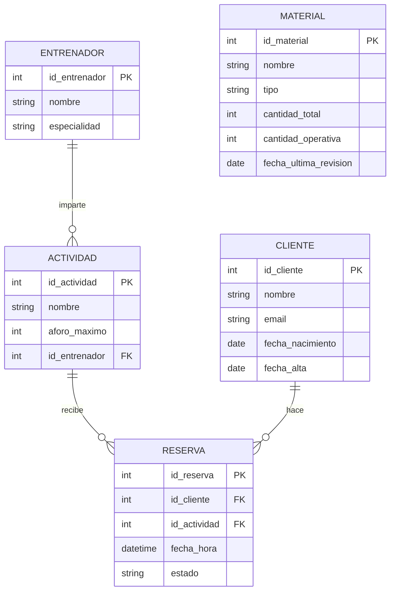
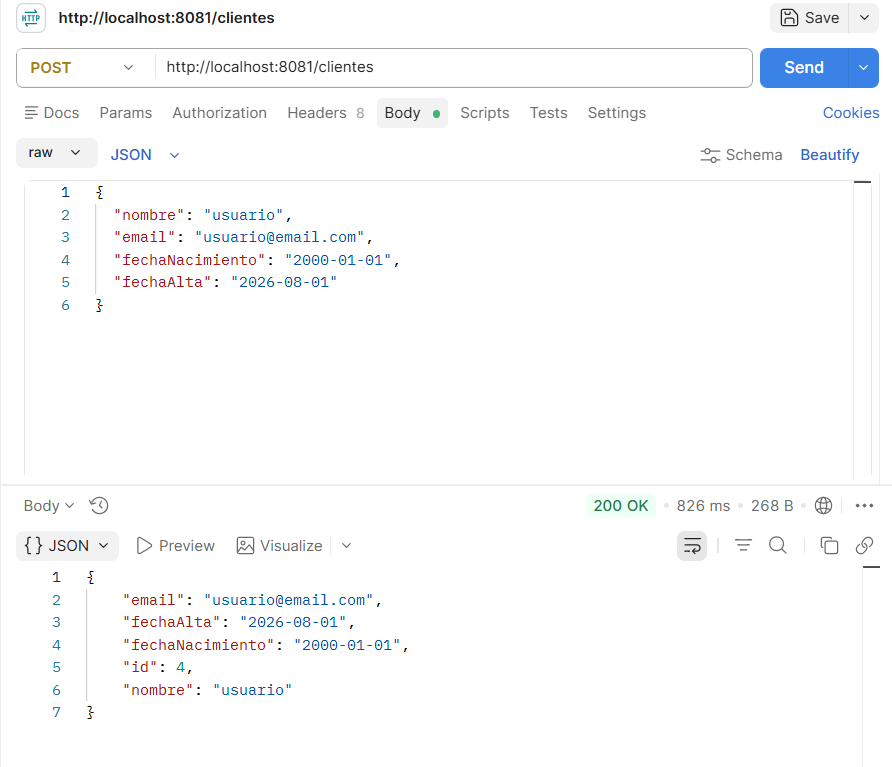
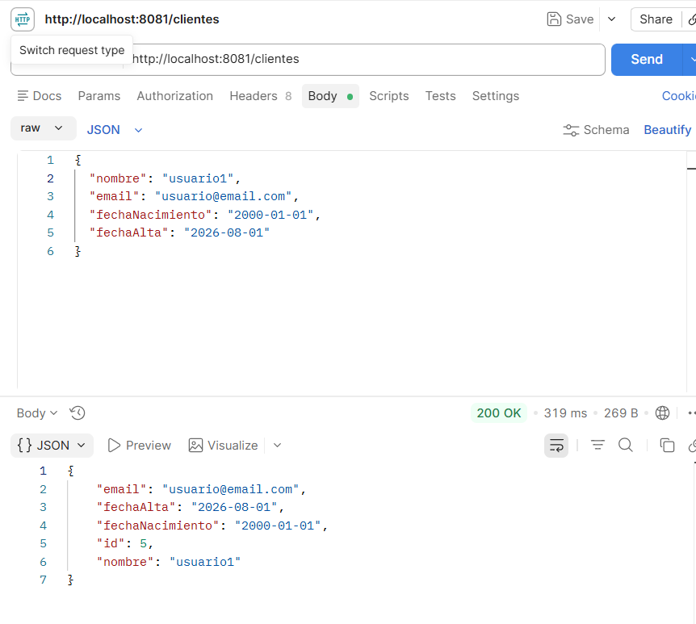
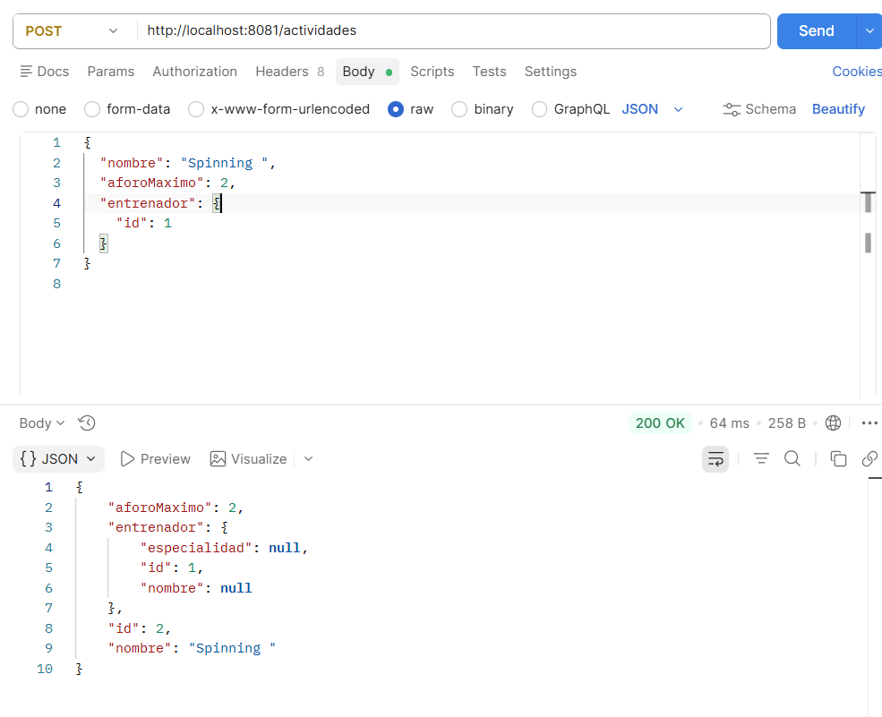
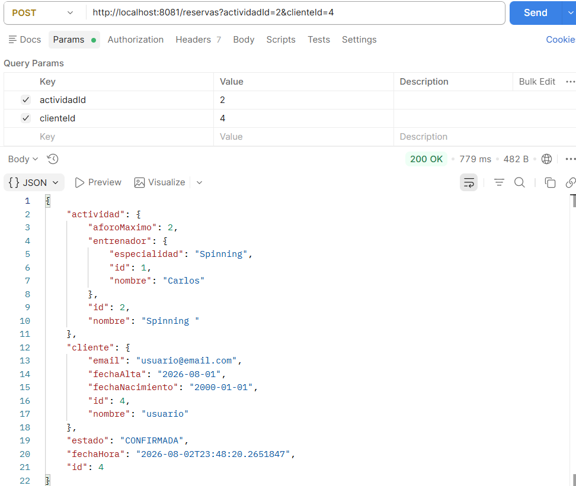
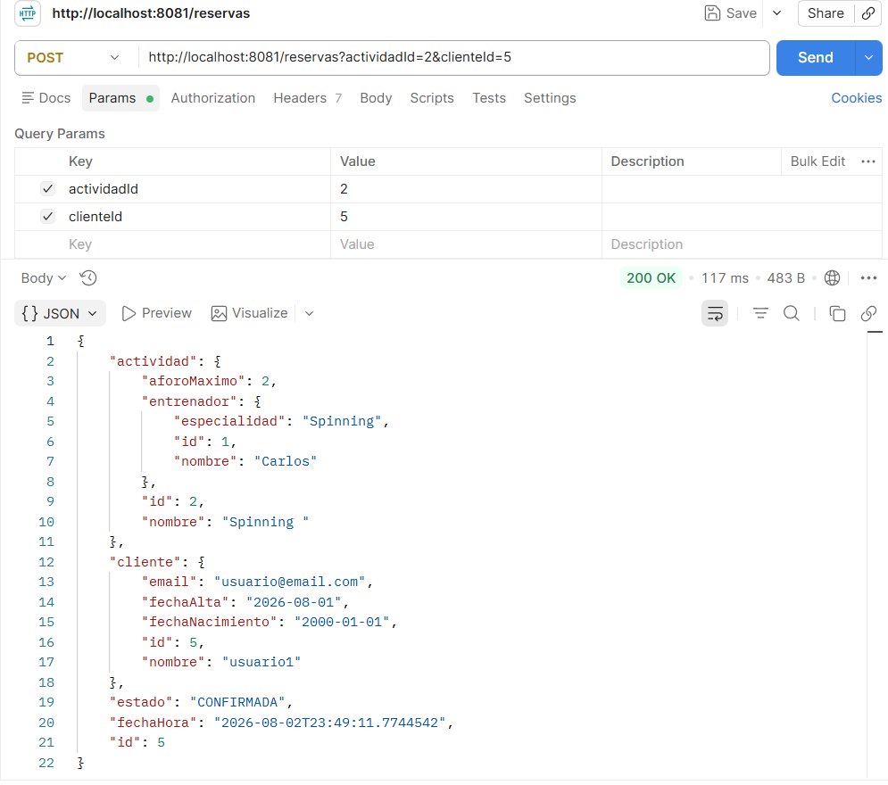
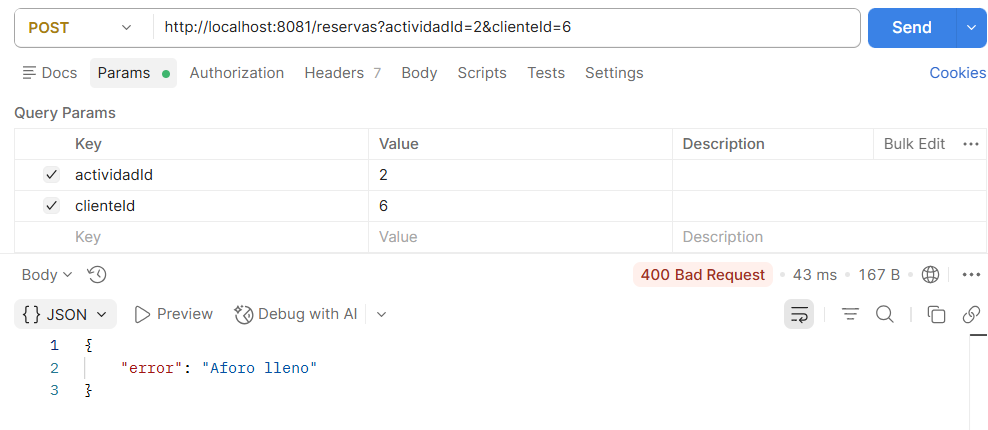

# Gimnasio API

API REST para la gestión de un gimnasio: clientes, entrenadores, actividades, reservas y material deportivo. Incluye control de aforo en las reservas y manejo de errores centralizado.
## Tecnologías

- Java 21
- Spring Boot 4.1
- Spring Data JPA / Hibernate
- MySQL
- Maven
- JUnit 5 + Mockito
## Modelo de datos


## Cómo ejecutarlo

### Requisitos
- Java 21
- Docker (para MySQL)
- Maven (incluido en el proyecto vía `mvnw`)

### Pasos

1. Levantar MySQL en Docker y crear la base de datos:
```sql
CREATE DATABASE gimnasio_db;
```

2. Configurar la conexión en `src/main/resources/application.properties` (ya incluido en el proyecto):
```properties
spring.datasource.url=jdbc:mysql://localhost:3306/gimnasio_db
spring.datasource.username=root
spring.datasource.password=
server.port=8081
```

3. Ejecutar la aplicación desde IntelliJ (`GimnasioApiApplication.java`) o con Maven:
```
mvnw spring-boot:run
```

4. La API estará disponible en `http://localhost:8081`

## Endpoints

| Recurso | Método | Ruta | Descripción |
|---|---|---|---|
| Cliente | GET | `/clientes` | Listar todos |
| Cliente | GET | `/clientes/{id}` | Buscar por id |
| Cliente | POST | `/clientes` | Crear |
| Cliente | PUT | `/clientes/{id}` | Actualizar |
| Cliente | DELETE | `/clientes/{id}` | Eliminar |
| Entrenador | GET / POST / PUT / DELETE | `/entrenadores` | Mismo patrón que Cliente |
| Actividad | GET / POST / PUT / DELETE | `/actividades` | Mismo patrón que Cliente |
| Material | GET / POST / PUT / DELETE | `/materiales` | Mismo patrón que Cliente |
| Reserva | GET | `/reservas` | Listar todas |
| Reserva | GET | `/reservas/{id}` | Buscar por id |
| Reserva | POST | `/reservas?actividadId=X&clienteId=Y` | Crear (valida aforo) |
| Reserva | PUT | `/reservas/{id}/cancelar` | Cancelar |

## Ejemplos de uso (Postman)

### Crear un cliente

### Creamos dos clientes más y una actividad con aforo máximo de dos personas
#### Segundo cliente

#### Tercer cliente
.png)
#### Actividad

#### Añadimos clientes


